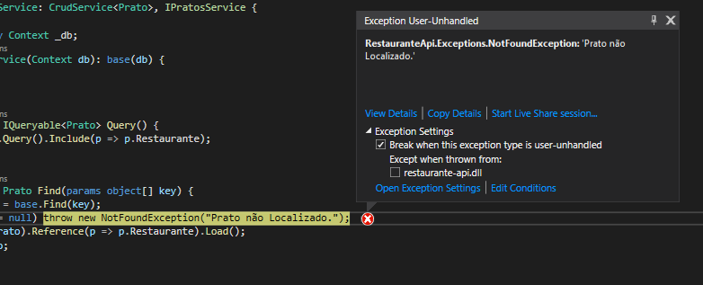

# Restaurante

Essa aplicação foi desenvolvida em .Net Core 2.2 e Angular 8. Seguem algumas considerações.

## Banco de Dados

Foi utilizado o SQL Server e o Migrations para manter o histórico de alterações do Model. Para criar/atualizar o banco de dados, modifique a ConnectionString Base no arquivo appsettings.json do projeto RestauranteApi e execute o comando `dotnet ef database update` no diretório do projeto. 

## Estrutura de Diretórios - Front-End

A organização do projeto Angular foi baseada no artigo [How to define a highly scalable folder structure for your Angular project](https://itnext.io/choosing-a-highly-scalable-folder-structure-in-angular-d987de65ec7).

## HttpErrorMiddleware

No projeto .Net Core, foi criado um Middleware para capturar as Exceções globalmente, e de acordo com a Exceção definir o HTTP Status Code e a mensagem de erro da resposta da requisição. Por esse motivo, existem métodos nos Controllers sem Try-Catch, já que o Middleware fará a captura da Exceção lançada pela camada de serviço.  
(Obs.: no modo de Debug do Visual Studio, antes do tratamento da Exceção pelo Middleware a execução pode ser interrompida quando a Exceção for lançada. Nesse caso, basta marcar a caixa restaurante-api.dll abaixo de "Break when this exception type is user-unhandled Except when thrown from", conforme imagem abaixo. Executando a aplicação diretamente pelo comando `dotnet run` não há esse problema.)  

## PaginationAttribute

Foi criado o ResultFilter PaginationAttribute para facilitar paginação de registros. Para utilizar, basta adicionar a annotation [Pagination] em uma Action do Controller que retorne um IQueryable. O PagintaionAttribute verifica se na URL da requisição existem as query params PageSize e PageNumber e faz a paginação dos registros, encapsulando o resultado em um objeto do tipo PagedResult. Foi utilizado esse recurso no método Get() de PratosController.

## Testes

Foi criado o projeto RestauranteApiTest para os testes unitários. Para rodar os testes basta executar o comando `dotnet test` no diretório do projeto.
